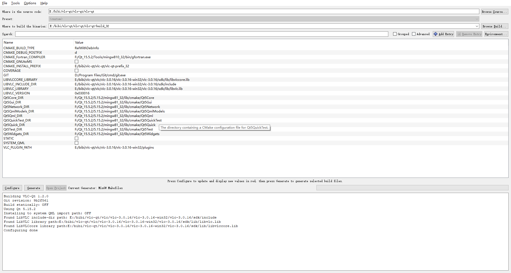
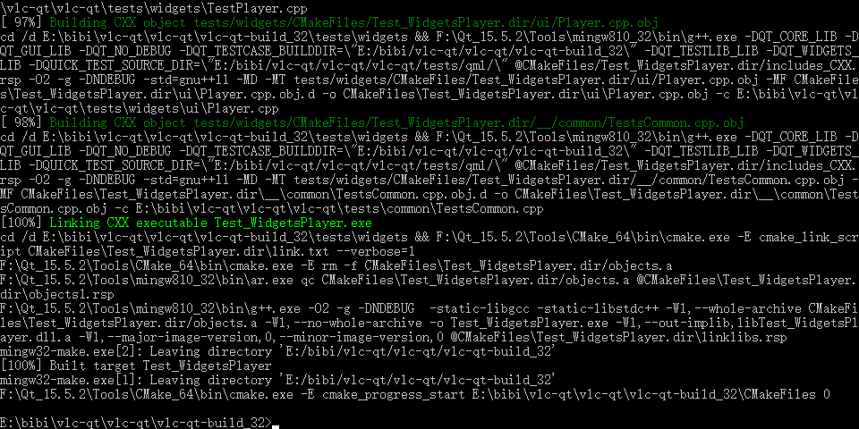
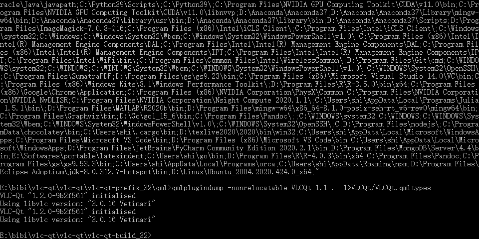
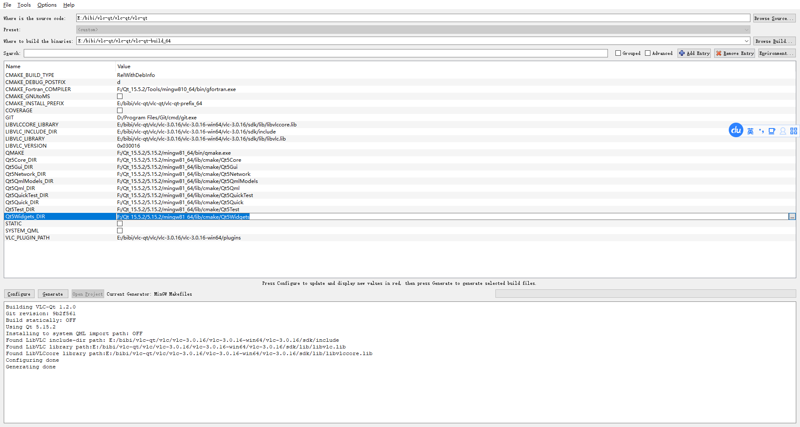
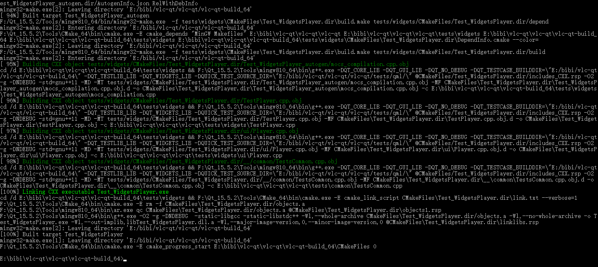
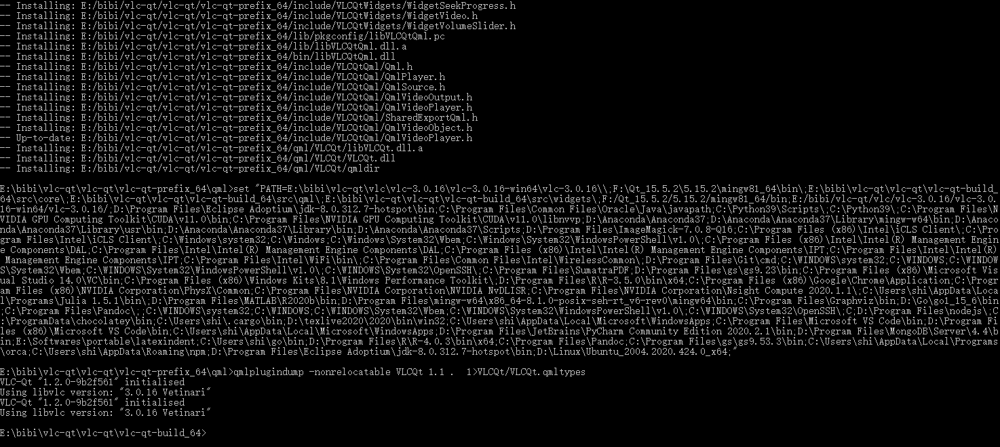

# Building VLC-Qt

## Requirements
VLC-Qt can be built with any common compiler (g++, clang, MSVC, MinGW).
Build files are generated using [CMake](http://www.cmake.org) (3.0.2 or later).

All stable versions of VLC since 2.1 work with VLC-Qt.
Qt 5 (version 5.5 or later recommende) is recommended as Qt 4 support is
considered deprecated. Binaries will always be provided for latest Qt version
released at the time of release.

**Make sure you have git submodules initialised or you may experience build issues.**

## CMake configuration
There are some specific CMake flags may need:

 * `COVERAGE`: generate coverage report, OFF by default
 * `DEBUG_SUFFIX`: add debug suffix 'd' to the libraries, ON on Widows, OFF elsewhere
 * `LIBVLC_VERSION`: set VLC version you are compiling with to disable unsupported

 	features, should be defined as base 16 integer like `0x020200`, defaults to
 	latest stable VLC version
 * `STATIC`: build statically, OFF by default
 * `SYSTEM_QML`: detect and install to system QML location, OFF by default

Extra platform specific flags:
 * `WITH_GLES`: link OpenGL ES v2 on Windows, OFF by default, only needed for
    Qt 5.4 and lower (deprecated)
 * `WITH_HOMEBREW`: let system know you are using Homebrew provided Qt,
    OFF by default, macOS only
 * `WITH_X11`: link with X11, required by some Linux distributions, OFF by default

Building in separate `build` directory is recommended.
There is a `test` target to run automatic tests for the library.

## Platform specific instructions
### macOS
You need to prepare VLC libraries and plugins before building. After `cmake` run
`make prepare`, then re-run `cmake`. Build as a normal library or application.

Supported generators are `make` and `ninja`.
Qt in `PATH` and VLC in `/Applications` will be used.

Make example:
```
$ export PATH=$PATH:/path/to/Qt/5.6/clang_64/bin
$ mkdir build
$ cd build
$ cmake .. -DCMAKE_BUILD_TYPE=Debug
$ make prepare
$ cmake ..
$ make -j8
$ make install
```

### Windows
Build as a normal library or application.

Make sure you always use debug libraries with debug build and release libraries
with release build after using it in your project.

Supported generators for MSVC are `nmake`, `jom` and `ninja`;
for MinGW: `mingw32-make` and `ninja`.
Run specific Qt shell to select its version. VLC path needs to be specified manually.

Ninja example for MSVC64:
```
$ md build
$ cd build
$ cmake .. -GNinja -DCMAKE_BUILD_TYPE=Debug ^
  -DCMAKE_INSTALL_PREFIX="E:/install/vlc-qt/msvc64" ^
  -DLIBVLC_LIBRARY="E:/vlc/win64/sdk/lib/libvlc.lib" ^
  -DLIBVLCCORE_LIBRARY="E:/vlc/win64/sdk/lib/libvlccore.lib" ^
  -DLIBVLC_INCLUDE_DIR="E:/vlc/win64/sdk/include"
$ ninja
$ ninja install
```

#### Windows + QT(15.5.2) + MINGW(8.10) + VLC(3.0.16)

We released binary version: qt-vlc-1.2.0-mingw(qt15.5.2_vlc3.0.16)

- Windows Build & Release with MinGW
- MinGW Win32/64 RelWithDebInfo Version 
- VLC-Qt version: "1.2.0-9b2f561" 
- libvlc version: "3.0.16 Vetinari"
- QT version: "15.5.2"


##### Prepare
- Install QT 15.5.2 [MinGW  Win32 & Win64] & Tools [MinGW  Win32 & Win64]
- Download File: Tag:0.10.0 windows/mingw/poll.h
- Download VLC 3.0.16 Win32 & Win64 


QT_ROOT = F:/Qt_15.5.2
VLC_ROOT = E:/bibi/vlc-qt/vlc/vlc-3.0.16/
VLC_WIN32 = E:/bibi/vlc-qt/vlc/vlc-3.0.16/vlc-3.0.16-win32
VLC_WIN64 = E:/bibi/vlc-qt/vlc/vlc-3.0.16/vlc-3.0.16-win64


##### WIN32 

- copy poll.h to E:\bibi\vlc-qt\vlc\vlc-3.0.16\vlc-3.0.16-win32\vlc-3.0.16\sdk\include\vlc\plugins
- change E:\bibi\vlc-qt\vlc\vlc-3.0.16\vlc-3.0.16-win32\vlc-3.0.16\sdk\include\vlc\plugins\vlc_threads.h
- add F:\Qt_15.5.2\Tools\mingw810_32\bin to PATH environment

```
#if defined (_WIN32)
# include <poll.h>
# include <process.h>
# ifndef ETIMEDOUT
#  define ETIMEDOUT 10060 /* This is the value in winsock.h. */
# endif
```

```
CMAKE_BINARY_DIR = E:/bibi/vlc-qt/vlc-qt/vlc-qt-build_32
# VLCQT_VERSION = 1.2.0
CMAKE_MAKE_PROGRAM = F:/Qt_15.5.2/Tools/mingw810_32/bin/mingw32-make.exe
CMAKE_INSTALL_PREFIX = E:/bibi/vlc-qt/vlc-qt/vlc-qt-prefix_32
CMAKE_BUILD_TYPE = RelWithDebInfo
CMAKE_DEBUG_POSTFIX = d

LIBVLC_VERSION =  0x030016
VLC_PLUGIN_PATH = E:/bibi/vlc-qt/vlc/vlc-3.0.16/vlc-3.0.16-win32/plugins

LIBVLC_LIBRARY = E:/bibi/vlc-qt/vlc/vlc-3.0.16/vlc-3.0.16-win32/vlc-3.0.16/sdk/lib/libvlc.lib
LIBVLCCORE_LIBRARY = E:/bibi/vlc-qt/vlc/vlc-3.0.16/vlc-3.0.16-win32/vlc-3.0.16/sdk/lib/libvlccore.lib
LIBVLC_INCLUDE_DIR = E:/bibi/vlc-qt/vlc/vlc-3.0.16/vlc-3.0.16-win32/vlc-3.0.16/sdk/include


LINK_DIRECTORIES(
	F:/Qt_15.5.2/Tools/mingw810_32/5.15.2/mingw81_32/bin
	E:/bibi/vlc-qt/vlc/vlc-3.0.16/vlc-3.0.16-win32/vlc-3.0.16/
)
```




```
cd E:/bibi/vlc-qt/vlc-qt/vlc-qt-build_32
set PATH=F:/Qt_15.5.2/5.15.2/mingw81_32/bin;E:/bibi/vlc-qt/vlc/vlc-3.0.16/vlc-3.0.16-win32/vlc-3.0.16/;%PATH%
F:/Qt_15.5.2/Tools/mingw810_32/bin/mingw32-make.exe
```




```
F:/Qt_15.5.2/Tools/mingw810_32/bin/mingw32-make.exe install
```




##### WIN64 
- copy poll.h to E:\bibi\vlc-qt\vlc\vlc-3.0.16\vlc-3.0.16-win64\vlc-3.0.16\sdk\include\vlc\plugins
- change E:\bibi\vlc-qt\vlc\vlc-3.0.16\vlc-3.0.16-win64\vlc-3.0.16\sdk\include\vlc\plugins\vlc_threads.h
- add F:\Qt_15.5.2\Tools\mingw810_64\bin to PATH environment

```
#if defined (_WIN32)
# include <poll.h>
# include <process.h>
# ifndef ETIMEDOUT
#  define ETIMEDOUT 10060 /* This is the value in winsock.h. */
# endif
```

```
CMAKE_BINARY_DIR = E:/bibi/vlc-qt/vlc-qt/vlc-qt-build_64
# VLCQT_VERSION = 1.2.0
CMAKE_MAKE_PROGRAM = F:/Qt_15.5.2/Tools/mingw810_64/bin/mingw32-make.exe
CMAKE_INSTALL_PREFIX = E:/bibi/vlc-qt/vlc-qt/vlc-qt-prefix_64
CMAKE_BUILD_TYPE = RelWithDebInfo
CMAKE_DEBUG_POSTFIX = d

LIBVLC_VERSION =  0x030016
VLC_PLUGIN_PATH = E:/bibi/vlc-qt/vlc/vlc-3.0.16/vlc-3.0.16-win64/plugins

LIBVLC_LIBRARY = E:/bibi/vlc-qt/vlc/vlc-3.0.16/vlc-3.0.16-win64/vlc-3.0.16/sdk/lib/libvlc.lib
LIBVLCCORE_LIBRARY = E:/bibi/vlc-qt/vlc/vlc-3.0.16/vlc-3.0.16-win64/vlc-3.0.16/sdk/lib/libvlccore.lib
LIBVLC_INCLUDE_DIR = E:/bibi/vlc-qt/vlc/vlc-3.0.16/vlc-3.0.16-win64/vlc-3.0.16/sdk/include


LINK_DIRECTORIES(
	F:/Qt_15.5.2/Tools/mingw810_32/5.15.2/mingw81_64/bin
	E:/bibi/vlc-qt/vlc/vlc-3.0.16/vlc-3.0.16-win64/vlc-3.0.16/
)
```



```
cd E:/bibi/vlc-qt/vlc-qt/vlc-qt-build_64
set PATH=F:/Qt_15.5.2/5.15.2/mingw81_64/bin;E:/bibi/vlc-qt/vlc/vlc-3.0.16/vlc-3.0.16-win64/vlc-3.0.16/;%PATH%
F:/Qt_15.5.2/Tools/mingw810_64/bin/mingw32-make.exe
```



```
F:/Qt_15.5.2/Tools/mingw810_64/bin/mingw32-make.exe install
```




### Linux
Install requirements from your distribution's repository.
Supported generators are `make` and `ninja`.

Make example:
```
$ mkdir build
$ cd build
$ cmake .. -DCMAKE_BUILD_TYPE=Debug
$ make -j8
$ make install
```
